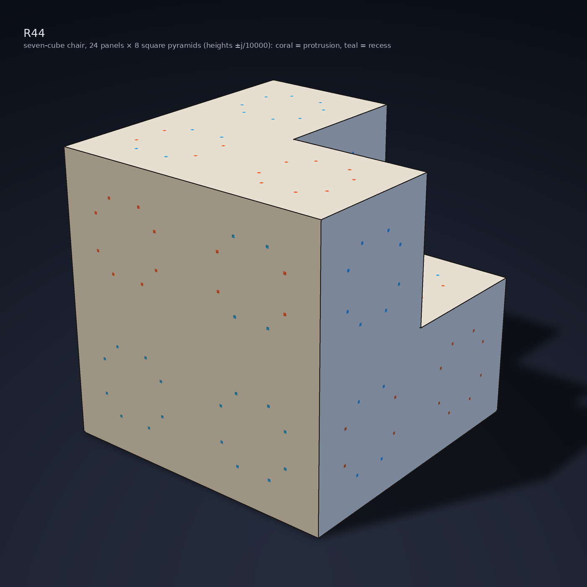
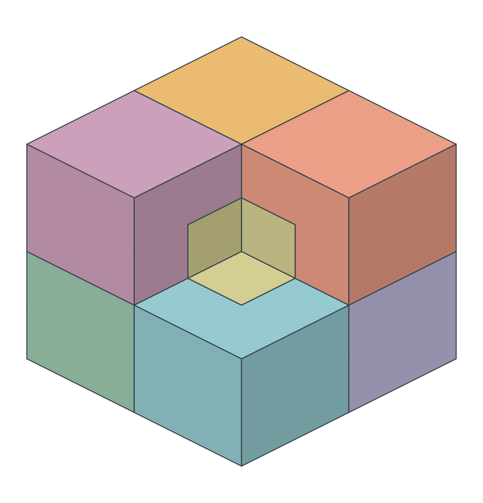
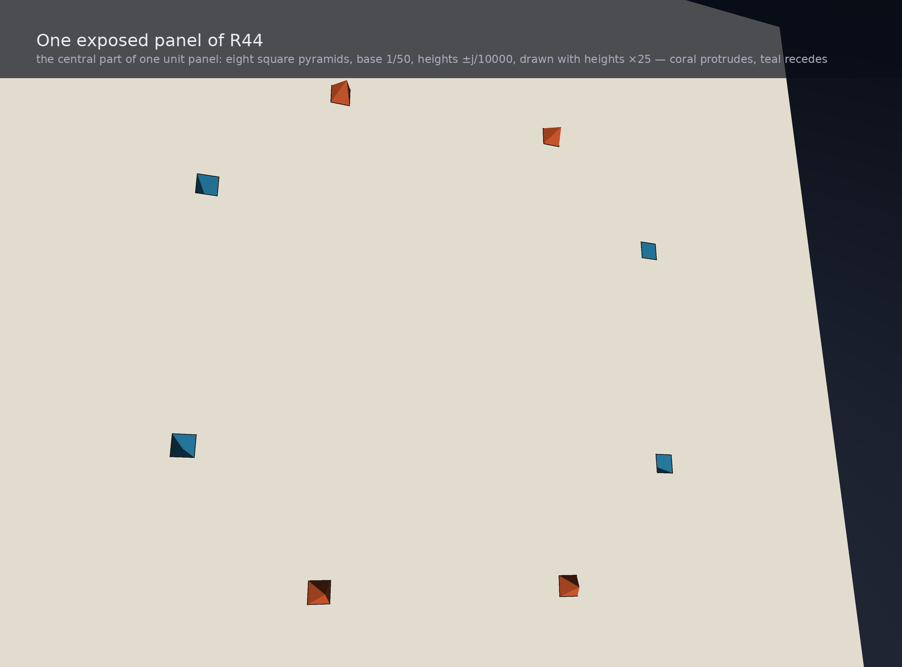

# Chair44 (R44) — a three-dimensional Einstein tile

**One unmarked three-dimensional shape that tiles space, but admits no tiling
with a nonzero translation period.** This repository presents **Chair44**, formally
identified throughout the project as **R44**, together with its proof,
exact data, independent checkers and Lean formalization.

**Project page:** [EmergenceCalculus.com/r44](https://www.EmergenceCalculus.com/r44)

**Paper DOI:** [10.5281/zenodo.22734468](https://doi.org/10.5281/zenodo.22734468)
(the reserved Zenodo page will become available when the record is published).

## Check it for yourself

Start with the way you prefer to explore a mathematical claim. These three
utilities help you inspect why Chair44 (R44) is an aperiodic 3D monotile.

### Explore the shape — interactive web app

**Online web app: coming soon.**
<!-- HOSTED_WEB_APP_URL: replace the coming-soon line with the supplied link. -->

Rotate the tile, enlarge its tiny bumps and dents, inspect individual features,
and see how eight copies fit together. No coding is needed.

**Use it now:** on this repository page, choose **Code → Download ZIP**, unzip
the download, and open `viewer/index.html` in your browser. No server or
installation is needed. [Viewer guide](viewer/README.md).

### Run the checks — executable notebook

**Online notebook: coming soon.**
<!-- HOSTED_NOTEBOOK_URL: replace the coming-soon line with the supplied link. -->

Work through six questions with interactive views and executable checks:
inspect the boundary, examine collision witnesses and parent certificates,
corrupt an input to test rejection, and compare periodic controls. Finish by
following the global argument to the paper and downloading your execution receipt.

**Use it now:** [download the notebook](notebook/r44_notebook.ipynb?raw=1), open it
in Jupyter or a compatible notebook service, and choose **Run All**.
[Local setup and notebook guide](notebook/README.md). The Python notebook reads
supplied Lean logs; running Lean yourself is a [separate option](notebook/LEAN.md).

### Ask your own AI — self-contained proof review package

The reading bundle and executable proof package are published with each
[GitHub release](https://github.com/ioannist/six-birds-tiles/releases). Their
source and reproducible package builder are in [reader/](reader/).
(7.84 MB)

Attach the **reading bundle** to a fresh AI conversation. If your AI can run
code, give it the **executable ZIP** instead and ask it to extract it. Then paste:

```text
Verify this works. Start with START_HERE and follow the included review prompt.
Tell me what you checked, what you could not check, and any concrete problems you found.
```

The package connects the claim to the paper, actual Lean definitions, exact data
and checks. The included prompt asks the AI to challenge five essential parts
of the argument and cite its evidence. Prior review reports are excluded so
your AI can assess the supplied argument independently.
[Package guide and build instructions](reader/README.md) ·
[Release downloads and checksums](https://github.com/ioannist/six-birds-tiles/releases).

These utilities guide your own
inspection and reproduction; they add no evidence for the theorem themselves.

## The tile and theorem

<p align="center"> </p>

> **Theorem (Chair44 / R44, proof submission).** The explicit rational polyhedral 3-ball
> Q in [solid/r44_solid.json](solid/r44_solid.json) tiles Euclidean 3-space by
> congruent copies (rotations and reflections allowed), and every such tiling
> has no nonzero translation period and a symmetry group of order at most 24.

The object: the seven-cube chair (a 2×2×2 block minus one corner) whose 24
exposed unit panels each carry eight tiny square-pyramid features of height
±j/10000, j = 1..12, base half-width 1/100. Volume 7. 2,138 vertices, 4,272
triangles, all coordinates rational. The features are the whole mechanism:
they are the only thing that distinguishes R44 from the periodic chair, and
they are 1/10000 of the tile's size. The colours in the figures are annotation
only (coral = bump, teal = dent; per-copy colours in the patch views): the
tile is one unmarked solid and the theorem uses shape alone, with no colours,
labels or matching rules.

<p align="center"> </p>

More views and how to regenerate them: [figures/](figures/).
The [viewer guide](viewer/README.md) explains the interactive controls and local use.

## Trust ledger (read this before citing anything)

| Tier | What | Where |
|---|---|---|
| T1 / T1n Lean-checked | **23** finite theorems covering every finite fact: dissection, profile, 44-contact atlas, 33 first shells, parent completions, 697→116→44 parent atlas, 6,862→44 companion census with 299,975 collision boxes, mesh reconstruction, boundary-sphere and angle audits, 48-frame asymmetry, the 168-label modular coincidence, and closure/classification of its legal fixed seeds (T1 = standard axioms only; T1n = additionally named native compiler hooks, listed per theorem) | `lean/R44/scripts/controls.sh` (positive `lake build` first, diagnostic-checked negative controls, positive scope regressions; `AXIOMS.md`) |
| T2 finite, replayed | the same facts independently in Python, plus 4,800 exact inverse/two-owner native tube-formula controls and an independent stdlib reconstruction of the 168-label substitution | `python3 verify/replay.py` (stdlib only) |
| T1 / T1n spine | kernel-checked unconditional `r44_einstein`: existence, no period, and \|Sym\| ≤ 24; all 19 former fields are discharged, with only the named compiler hooks listed in `AXIOMS.md` | `lean/R44/scripts/controls.sh`; `lean/R44/R44/LogicalSpine.lean`; `lean/R44/HYPOTHESES.md` |
| Written exposition | the original geometric arguments remain as exposition and provenance for the now-formalized endpoints | [proof/](proof/) |

Packets C2 and C3(a) add logical-spine theorems; C3(c) adds
`substitution_modular_coincidence`, and P1 adds `seed_language_closure`, taking
the finite count to exactly **23**.
C3(a) makes no fixed-cell exhaustion or local-derivability claim. The cited
Lee--Moody/Schlottmann import applies to the substitution hull; whether every
tiling lies in that hull remains open because of possible fault lines.

Status by the authors' own ledger: **proof submission, externally reviewed**. Two external
adversarial review rounds (2026-09-08, `proof/review/external_2026-09-08/` and
`proof/review/external_2026-09-08_r2/`): round 1 found the written geometric proof sound and the
finite gates reproduced by an independent checker, and found the Lean hypothesis record
inconsistent (a missing distinct-tile premise). The source repair has been applied (packet L5X),
reviewed internally (Eddy, CLEAN) and gate-built; round 2 ruled HOLDS-AS-STATED on the repaired
archive with no blocking or major findings. Review status is distinct from
formalization status: the round-2 reviewer could not run Lean. The current proof
submission is kernel-checked modulo the named compiler hooks; written proofs
remain as exposition. [THEOREM.md](THEOREM.md) lists every lemma with its tier.

## Run checks from a local checkout

For the finite Python checks, run these commands from the repository root:

```sh
python3 lean/R44/gen/extract.py --check        # generated Lean inputs match canonical data
python3 verify/replay.py                      # replay exact certificate checks
python3 verify/packets/r44_unrestricted_alignment/src/test_mutations.py  # reject six corrupted inputs
python3 -m unittest discover simulations/tests  # additional simulation checks
```

These Python commands use the standard library: plain `python3`, no `-O`,
no extra packages, no solver and no network. The main replay took about
28–30 seconds in recorded runs; your runtime may differ.

For a **fresh Lean build, negative controls and axiom comparison**, follow the
[formal-build guide](notebook/LEAN.md). Allow about **16 GB RAM, 30 minutes or
more, and a multi-gigabyte dependency download**. This is separate from the
Python checks above.

## Layout

| Path | Contents |
|---|---|
| [THEOREM.md](THEOREM.md) | statement, lemma dependency graph, trust tier per lemma |
| [notebook/](notebook/) | clean executable notebook, reviewable Python source, tests and local setup |
| [reader/](reader/) | reproducible AI reading-bundle builder, review prompt and package checks; generated bundles are release assets |
| [.devcontainer/](.devcontainer/) | optional environment for running the pinned Lean build; see the formal-build guide |
| [LINEAGE.md](LINEAGE.md) | how this repo's chair thread and six external packets led to R44 |
| [solid/](solid/) | authoritative rational mesh, OBJ viewer file, 24×8 feature coefficient table |
| [proof/](proof/) | registered-theorem proof, unrestricted-alignment proof, claim ledgers and review prompt |
| [certificates/](certificates/) | the four finite certificates, pinned by SHA256SUMS |
| [verify/](verify/) | one entrypoint plus the two proof packets' checkers, unchanged |
| [provenance/HASH_CHAIN.md](provenance/HASH_CHAIN.md) | compact pointer to the archived construction packets |
| [viewer/](viewer/) | in-browser 3D viewer: tile, eight-child cluster, 64 and 512-copy patches, feature exaggeration, click-to-inspect |
| [figures/](figures/) | renders of the solid, one panel, the eight-child cluster and a 64-tile patch, from the canonical data |
| [media/](media/) | public image generators, rebuild instructions and a selected set of web assets |
| [video/](video/) | film source, captions, evidence map and reproducible production scripts; movies are release assets |
| [simulations/](simulations/) | patch generator (nested existence patches, OBJ export), parent recogniser, parameter-family checker, bounded exploratory searches; reproduces T2 facts only |
| [calibration_2d/](calibration_2d/) | controlled reconstruction of the published 2D hat; downloaded papers are not redistributed |
| [research/](research/) | literature dossier |
| [PUBLIC_RELEASE.md](PUBLIC_RELEASE.md) | public-tree boundary and policy for generated release assets |

## License

Except where a file identifies third-party terms, original material in this
repository is © 2026 Ioannis Tsiokos and licensed under the
[Creative Commons Attribution 4.0 International License](LICENSE). Vendored
material retains its own licence and attribution.
